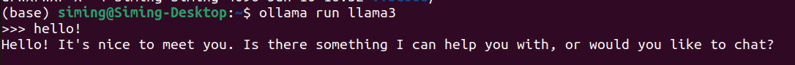
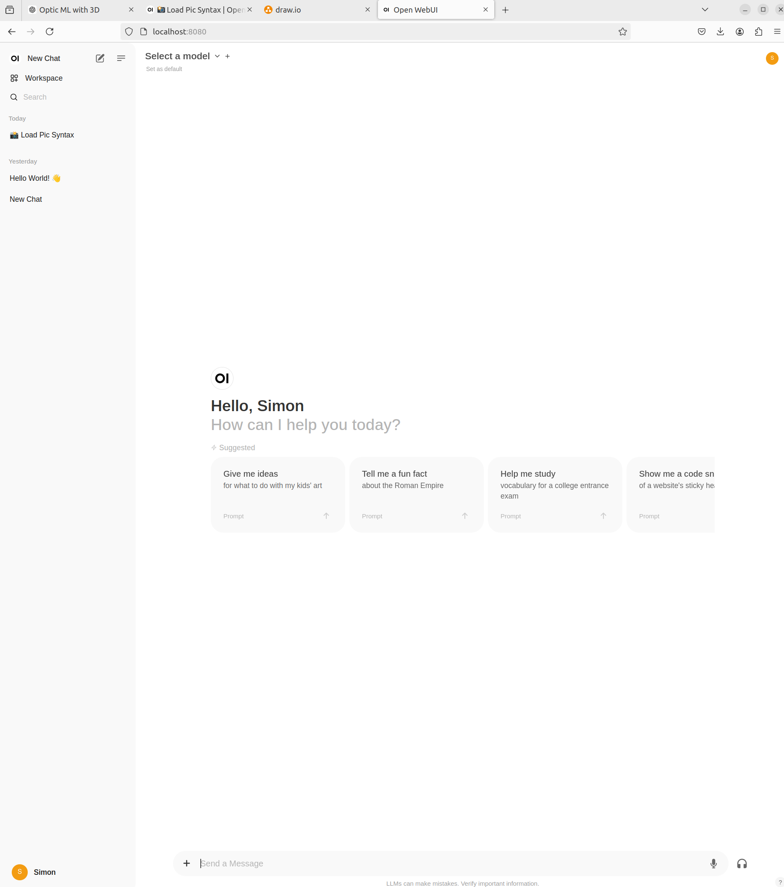
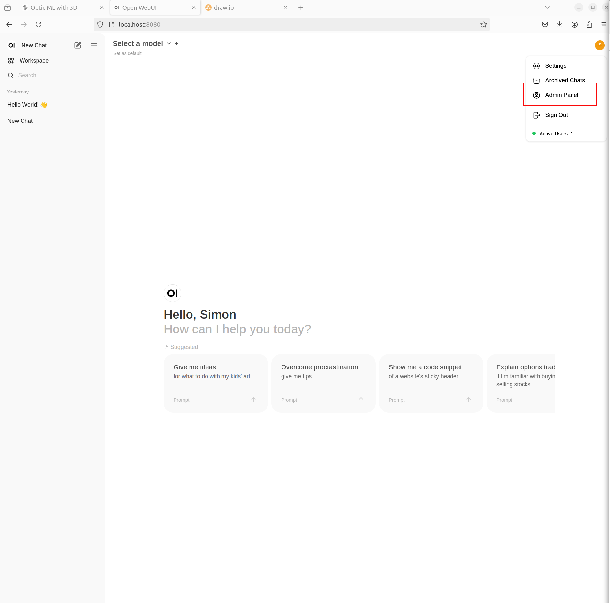
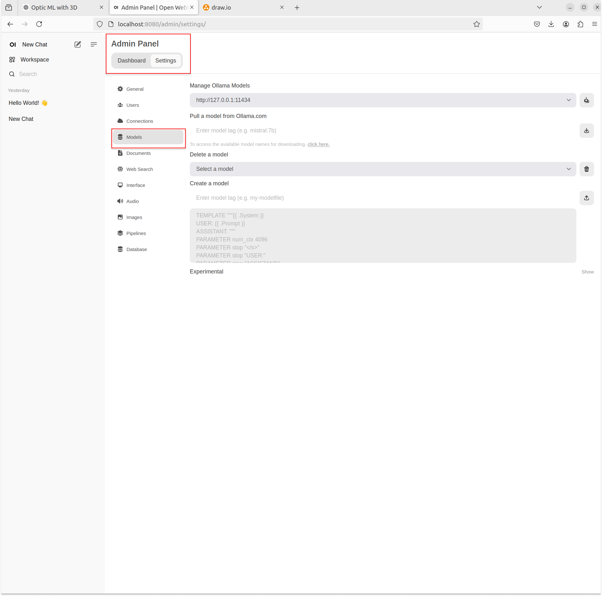
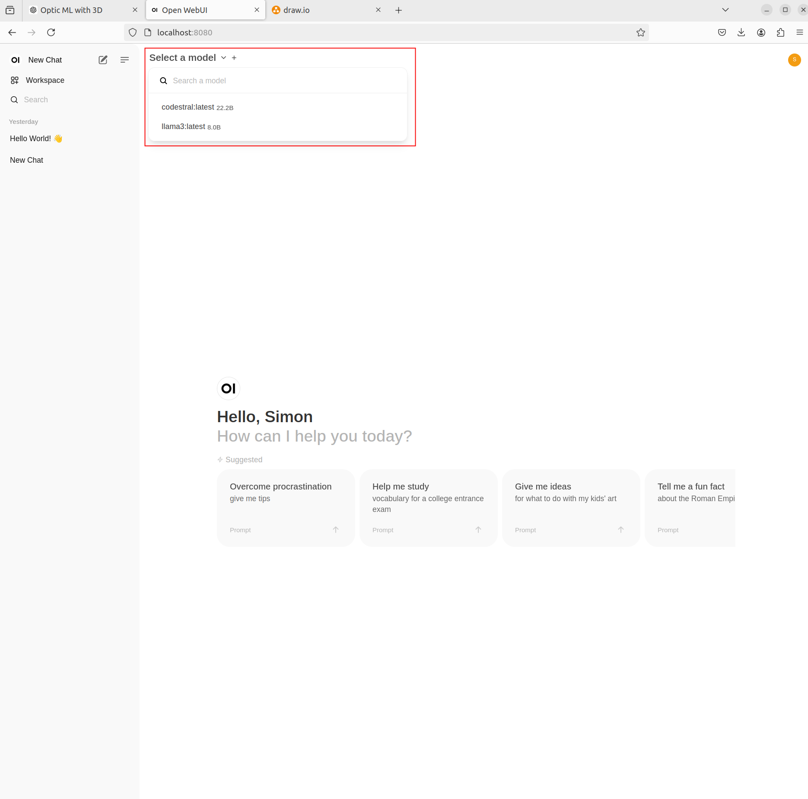

# Local-LLM (Linux Environment)
This is a introduction page for downloading ollama and webui (the interactive interface) locally.

## steps

### Step 1. Download Ollama in your local machine. 
```bash
curl -fsSL https://ollama.com/install.sh | sh
```

### step 2. to ensure ollama is installed, you can run it locally
```bash
ollama run llama3
```

Now, you can chat with a LLM in your terminal!! 



### Note: 
If you run into issues with step 1 or step2, check the [ollama](https://github.com/ollama/ollama) github link to debug!
if you want to try other models, simply run `ollama run <model_name>`. 


Now, you may wonder is there any user friendly interface we can have to have a better conversation experience? Yes! So, step3 and step4 will allow you to run front end, and with 2 command lines, you can have a chat window with your local LLM!

### step3. Install the front end in your machine with one docker command (running first-time will take time, be patient). 
```bash
docker run -d --network=host -v open-webui:/app/backend/data -e OLLAMA_BASE_URL=http://127.0.0.1:11434 --name open-webui --restart always ghcr.io/open-webui/open-webui:main
```

### Step 4. Open the webui for the user interface (before running this please make sure that 8080 port is not run by other apps). 
The default URL is http://localhost:8080/

### Note:
if you run into issues of using webui, check the offical github [here](https://github.com/open-webui/open-webui)


## LLM model Download and Selection

Right now, you have both frontend and backend installed in your local machine. To Select models. Following the following steps to download any models you like.

This is the interface you will be facing:


Click on Admin Panel on the upper right corner.


Go to Settings and find the Models tag to download and select the models.


Once you download the model, you can go back to chat panel and start a conversation!!!


This is the [model libraries](https://ollama.com/library) you can pull from and chat!


This is just an example of how you can download the LLM locally, there are many more ways to do it, and congrats! now you have your local LLM installed in your local machine and start to chat with it!
